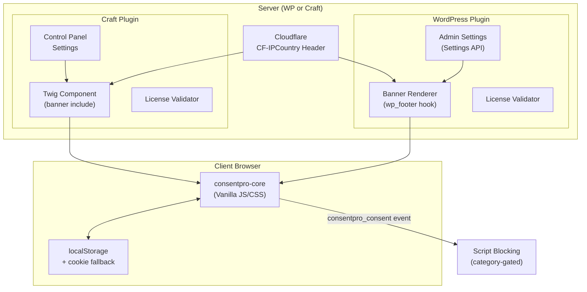
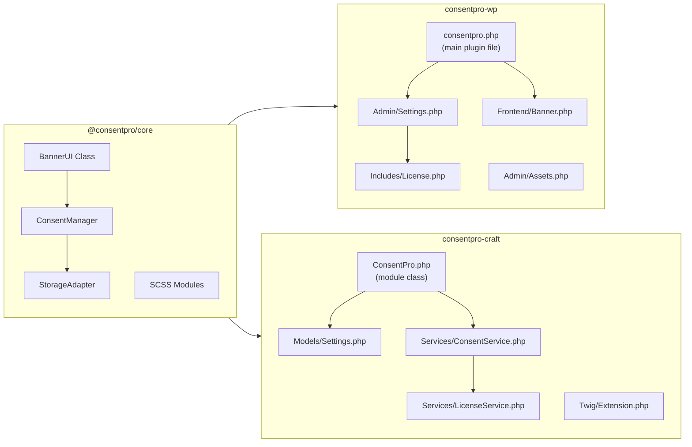
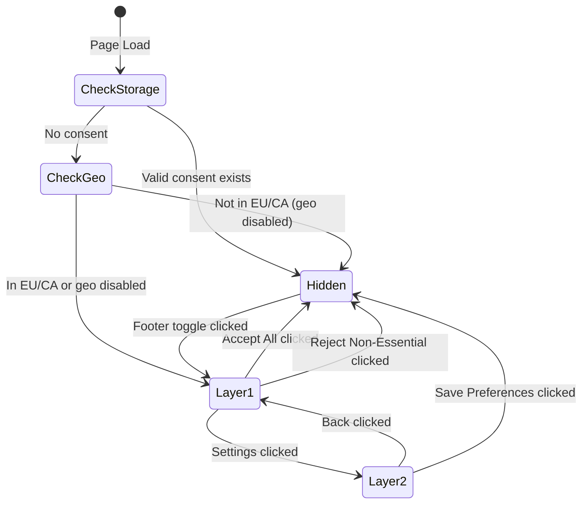
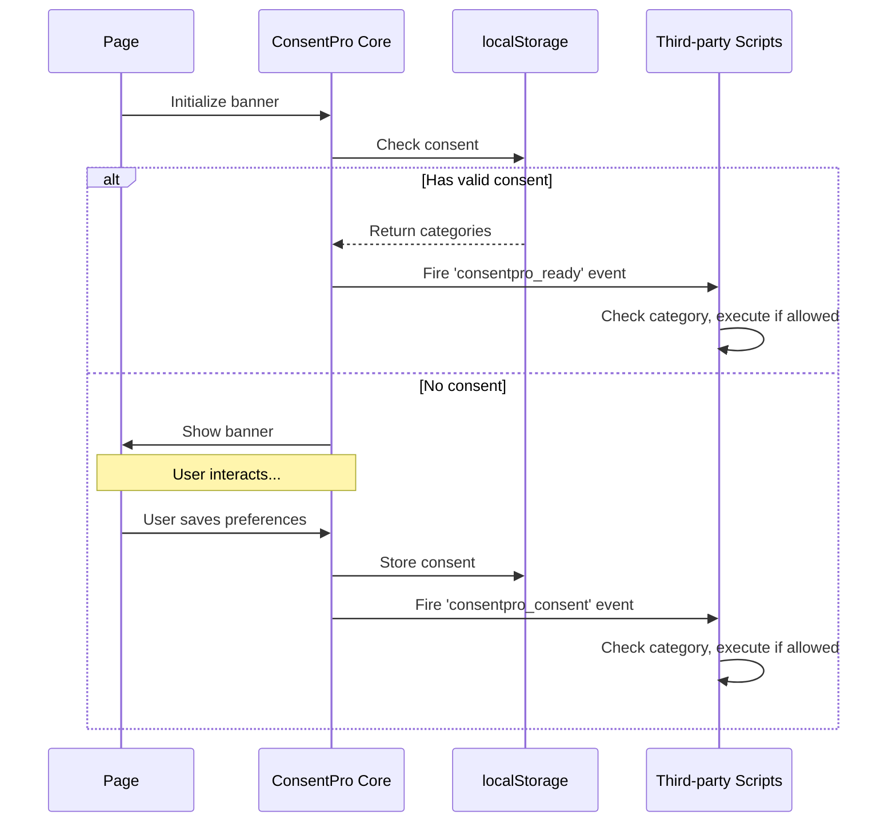
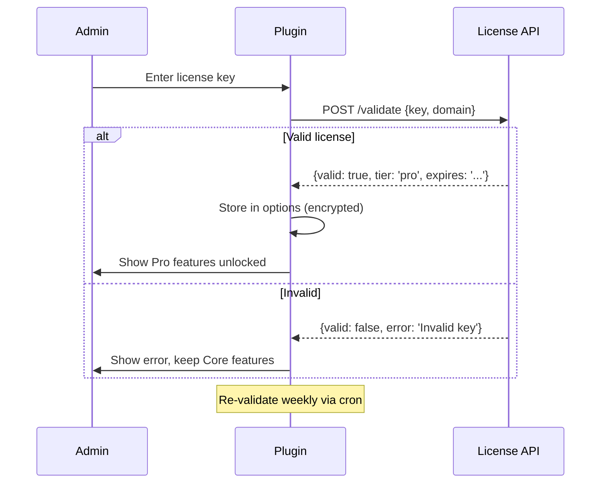

# ConsentPro Technical Architecture Document

## 1. High-Level Architecture



-----

## 2. Component Architecture



-----

## 3. Detailed File Structure

```
consentpro-monorepo/
│
├── packages/
│   └── consentpro-core/
│       ├── src/
│       │   ├── js/
│       │   │   ├── index.ts              # Main entry, exports public API
│       │   │   ├── ConsentManager.ts     # Consent state, storage, events
│       │   │   ├── BannerUI.ts           # DOM rendering, Layer 1/2 logic
│       │   │   ├── StorageAdapter.ts     # localStorage + cookie fallback
│       │   │   ├── GeoDetector.ts        # Read geo from data attr
│       │   │   └── types.ts              # TypeScript interfaces
│       │   │
│       │   └── scss/
│       │       ├── _variables.scss       # Colors, spacing, breakpoints
│       │       ├── _banner.scss          # Layer 1 styles
│       │       ├── _settings-panel.scss  # Layer 2 styles
│       │       ├── _animations.scss      # Slide-in, transitions
│       │       └── main.scss             # Entry point
│       │
│       ├── dist/                         # Build output (git-ignored)
│       │   ├── consentpro.min.js
│       │   ├── consentpro.min.css
│       │   └── consentpro.d.ts
│       │
│       ├── package.json
│       ├── tsconfig.json
│       ├── rollup.config.js              # Bundle to IIFE + ESM
│       └── README.md
│
├── plugins/
│   ├── consentpro-wp/
│   │   ├── consentpro.php                # Plugin header, bootstrap
│   │   ├── uninstall.php                 # Cleanup on uninstall
│   │   │
│   │   ├── includes/
│   │   │   ├── class-consentpro.php      # Main plugin class
│   │   │   ├── class-activator.php       # Activation hooks
│   │   │   ├── class-deactivator.php     # Deactivation hooks
│   │   │   └── class-license.php         # License validation
│   │   │
│   │   ├── admin/
│   │   │   ├── class-admin.php           # Admin hooks, menu registration
│   │   │   ├── class-settings.php        # Settings API fields
│   │   │   ├── views/
│   │   │   │   ├── settings-page.php     # Main settings template
│   │   │   │   ├── partials/
│   │   │   │   │   ├── general-tab.php
│   │   │   │   │   ├── appearance-tab.php
│   │   │   │   │   ├── categories-tab.php
│   │   │   │   │   ├── consent-log-tab.php
│   │   │   │   │   └── license-tab.php
│   │   │   │   └── preview-frame.php     # Live preview iframe
│   │   │   │
│   │   │   └── assets/
│   │   │       ├── admin.css
│   │   │       └── admin.js              # Color pickers, preview, AJAX
│   │   │
│   │   ├── public/
│   │   │   ├── class-public.php          # Frontend hooks
│   │   │   └── class-banner.php          # Banner output, data attributes
│   │   │
│   │   ├── assets/                       # Copied from core dist/
│   │   │   ├── consentpro.min.js
│   │   │   └── consentpro.min.css
│   │   │
│   │   ├── languages/                    # Future i18n
│   │   │   └── consentpro.pot
│   │   │
│   │   ├── composer.json
│   │   └── README.md
│   │
│   └── consentpro-craft/
│       ├── src/
│       │   ├── ConsentPro.php            # Main module class
│       │   │
│       │   ├── models/
│       │   │   └── Settings.php          # Plugin settings model
│       │   │
│       │   ├── services/
│       │   │   ├── ConsentService.php    # Banner config builder
│       │   │   └── LicenseService.php    # License validation
│       │   │
│       │   ├── controllers/
│       │   │   └── SettingsController.php # CP settings actions
│       │   │
│       │   ├── twig/
│       │   │   └── ConsentProExtension.php # Twig functions/globals
│       │   │
│       │   ├── web/
│       │   │   └── assets/
│       │   │       └── ConsentProAsset.php # Asset bundle
│       │   │
│       │   └── templates/
│       │       ├── settings/
│       │       │   ├── index.twig        # Main settings page
│       │       │   ├── _general.twig
│       │       │   ├── _appearance.twig
│       │       │   ├── _categories.twig
│       │       │   ├── _consent-log.twig
│       │       │   └── _license.twig
│       │       │
│       │       └── banner/
│       │           └── _banner.twig      # Frontend include
│       │
│       ├── resources/
│       │   ├── js/
│       │   │   └── cp.js                 # Control panel scripts
│       │   └── css/
│       │       └── cp.css                # Control panel styles
│       │
│       ├── composer.json
│       ├── LICENSE.md
│       └── README.md
│
├── docs/
│   ├── PRD.md
│   ├── compliance-notes.md
│   ├── wireframes/
│   │   ├── layer-1.png
│   │   └── layer-2.png
│   └── api-reference.md
│
├── .github/
│   └── workflows/
│       ├── ci.yml                        # Lint + test on PR
│       ├── build.yml                     # Build core + plugins
│       └── release.yml                   # Tag → GitHub releases + zips
│
├── package.json                          # Workspace root
├── pnpm-workspace.yaml                   # pnpm workspace config
├── .eslintrc.js
├── .prettierrc
├── .gitignore
└── README.md
```

-----

## 4. Data Flow

### 4.1 Consent Storage Schema

```typescript
// localStorage key: 'consentpro_consent'
interface ConsentData {
  version: number;                    // Schema version for migrations
  timestamp: number;                  // Unix ms when consent given
  geo: string | null;                 // 'EU' | 'CA' | null
  categories: {
    essential: true;                  // Always true, immutable
    analytics: boolean;
    marketing: boolean;
    personalization: boolean;
  };
  hash: string;                       // SHA-256 of settings (detect config changes)
}
```

### 4.2 Banner State Machine



### 4.3 Script Blocking Flow



### 4.4 Script Integration Pattern

```html
<!-- Analytics script (category: analytics) -->
<script type="text/plain" data-consentpro="analytics" src="https://..."></script>

<!-- Or inline -->
<script type="text/plain" data-consentpro="marketing">
  fbq('init', '...');
</script>

<!-- ConsentPro activates scripts when consent given -->
```

-----

## 5. Tech Stack Decision Table

|Component             |Choice               |Alternatives Considered  |Rationale                                          |
|----------------------|---------------------|-------------------------|---------------------------------------------------|
|**JS Bundler**        |Rollup               |Webpack, esbuild, Vite   |Smallest output, native ESM + IIFE, tree-shaking   |
|**JS Language**       |TypeScript           |Vanilla JS               |Type safety, better DX, compile-time errors        |
|**CSS**               |SCSS → PostCSS       |Tailwind, CSS-in-JS      |No runtime, small output, familiar to WP/Craft devs|
|**Package Manager**   |pnpm                 |npm, Yarn                |Faster installs, disk efficient, native workspaces |
|**WP Admin UI**       |Settings API + custom|ACF, CMB2                |No dependencies, full control, lighter             |
|**Craft Settings**    |Native CP fields     |None                     |Standard Craft pattern, best DX                    |
|**License Validation**|Custom + remote check|EDD SL, Gumroad          |Control over UX, no vendor lock-in                 |
|**Geo Detection**     |Cloudflare headers   |MaxMind, ipapi           |Zero latency, privacy-friendly, no external calls  |
|**Storage**           |localStorage + cookie|IndexedDB, sessionStorage|Best persistence, cookie fallback for Safari ITP   |
|**CI/CD**             |GitHub Actions       |GitLab CI, CircleCI      |Native to GitHub, generous free tier, good caching |

-----

## 6. Implementation Roadmap

### Phase 1: Foundation (Week 1)

|Day|Task                                                            |Output                   |
|---|----------------------------------------------------------------|-------------------------|
|1-2|Monorepo setup, pnpm workspaces, Rollup config                  |Build pipeline working   |
|2-3|Core TypeScript structure: ConsentManager, StorageAdapter, types|Consent logic complete   |
|3-4|BannerUI: Layer 1 + Layer 2 DOM rendering                       |Banner renders (unstyled)|
|4-5|SCSS: Variables, banner styles, animations                      |<5KB styled banner       |

**Week 1 Deliverable:** Standalone HTML demo of banner with full consent flow.

-----

### Phase 2: WordPress Plugin (Week 2)

|Day|Task                                                     |Output                  |
|---|---------------------------------------------------------|------------------------|
|1  |Plugin scaffold, main class, activation hooks            |Plugin activates in WP  |
|2  |Settings API: General tab (policy URL, geo toggle)       |Settings save/load      |
|3  |Settings API: Appearance tab (colors, text fields)       |Customization working   |
|3-4|Settings API: Categories tab, consent log viewer         |Full admin UI           |
|4  |Frontend: Banner injection via wp_footer, data attributes|Banner shows on frontend|
|5  |License scaffold: validation class, Pro CSS field (gated)|License flow tested     |

**Week 2 Deliverable:** Functional WP plugin with full admin UI and frontend banner.

-----

### Phase 3: Craft Plugin (Week 3)

|Day|Task                                             |Output                     |
|---|-------------------------------------------------|---------------------------|
|1  |Composer package, module class, settings model   |Plugin installs in Craft   |
|2  |CP settings: General + Appearance tabs           |Settings save/load         |
|3  |CP settings: Categories + Consent log tabs       |Full admin UI              |
|3-4|Twig extension: `{{ craft.consentpro.banner() }}`|Banner renders in templates|
|4  |Asset bundle, frontend injection                 |Auto-inject option working |
|5  |License service, Pro CSS field (gated)           |License flow tested        |

**Week 3 Deliverable:** Functional Craft plugin with CP settings and Twig integration.

-----

### Phase 4: Polish & QA (Week 4)

|Day|Task                                                       |Output               |
|---|-----------------------------------------------------------|---------------------|
|1  |Cross-browser testing (Chrome, FF, Safari, Edge)           |Bug fixes            |
|2  |Mobile testing, touch interactions, viewport edge cases    |Responsive fixes     |
|2-3|Accessibility audit: focus traps, ARIA labels, keyboard nav|WCAG 2.1 AA compliant|
|3  |Performance audit: <5KB check, lighthouse, no CLS          |Performance validated|
|4  |Script blocking integration tests                          |Category gating works|
|5  |Documentation: README, inline docs, user guide draft       |Docs complete        |

**Week 4 Deliverable:** Production-ready MVP for both platforms.

-----

## 7. Key Technical Decisions

### 7.1 Cookie Fallback Strategy

Safari ITP limits localStorage for third-party contexts. We use a dual-write approach:

```typescript
class StorageAdapter {
  set(data: ConsentData): void {
    // Primary: localStorage (12-month persistence)
    localStorage.setItem('consentpro_consent', JSON.stringify(data));
    
    // Fallback: First-party cookie (365 days, SameSite=Lax)
    document.cookie = `consentpro=${encodeURIComponent(JSON.stringify(data))}; max-age=31536000; path=/; SameSite=Lax`;
  }
  
  get(): ConsentData | null {
    // Try localStorage first, fall back to cookie
    const ls = localStorage.getItem('consentpro_consent');
    if (ls) return JSON.parse(ls);
    
    const cookie = this.getCookie('consentpro');
    if (cookie) return JSON.parse(decodeURIComponent(cookie));
    
    return null;
  }
}
```

### 7.2 Geo Detection Data Flow

```php
// WordPress (public/class-banner.php)
public function get_banner_data(): array {
    $geo = $_SERVER['HTTP_CF_IPCOUNTRY'] ?? null;
    $eu_countries = ['AT','BE','BG','HR','CY','CZ','DK','EE','FI','FR','DE','GR','HU','IE','IT','LV','LT','LU','MT','NL','PL','PT','RO','SK','SI','ES','SE'];
    
    $region = null;
    if ($geo === 'CA') $region = 'CA';
    elseif (in_array($geo, $eu_countries)) $region = 'EU';
    
    return [
        'geo' => $region,
        'geoEnabled' => get_option('consentpro_geo_enabled', true),
        // ... other settings
    ];
}
```

```html
<!-- Output -->
<div id="consentpro-banner" 
     data-config='{"geo":"EU","geoEnabled":true,...}'>
</div>
```

### 7.3 License Validation Flow



-----

## 8. Risk Mitigation

|Risk                      |Likelihood|Impact|Mitigation                                     |
|--------------------------|----------|------|-----------------------------------------------|
|Bundle exceeds 10KB       |Medium    |High  |Tree-shaking, no runtime deps, gzip target <5KB|
|Safari ITP blocks storage |Low       |Medium|Cookie fallback implemented                    |
|Cloudflare header missing |Medium    |Low   |Settings fallback: show to all or manual region|
|License API downtime      |Low       |Medium|7-day grace period, offline validation cache   |
|Craft 5.x breaking changes|Low       |Medium|Pin to stable, test against RC releases        |

-----

## 9. Testing Strategy

### Unit Tests (Jest)

- ConsentManager: state transitions, storage calls
- StorageAdapter: localStorage/cookie read-write
- BannerUI: DOM rendering, event handlers

### Integration Tests (Cypress)

- Full consent flow: Layer 1 → Layer 2 → Save
- Script blocking: verify scripts activate on consent
- Geo targeting: mock headers, verify banner visibility
- Persistence: consent survives page reload

### Platform Tests

- **WordPress:** PHPUnit for settings API, WP test suite for hooks
- **Craft:** Codeception for CP settings, service tests

### Manual QA Checklist

- [ ] Mobile: iOS Safari, Android Chrome
- [ ] Desktop: Chrome, Firefox, Safari, Edge
- [ ] Screen readers: VoiceOver, NVDA
- [ ] Keyboard-only navigation
- [ ] Slow network (3G throttle)
- [ ] No JavaScript fallback (graceful degradation)

-----

## Next Steps

This architecture document provides the complete blueprint for ConsentPro MVP. Ready to proceed with:

1. **Immediate:** Set up monorepo scaffold and build pipeline
1. **This week:** Begin `consentpro-core` implementation (ConsentManager → BannerUI)
1. **Review needed:** Wireframes for Layer 1/Layer 2 UI before finalizing SCSS